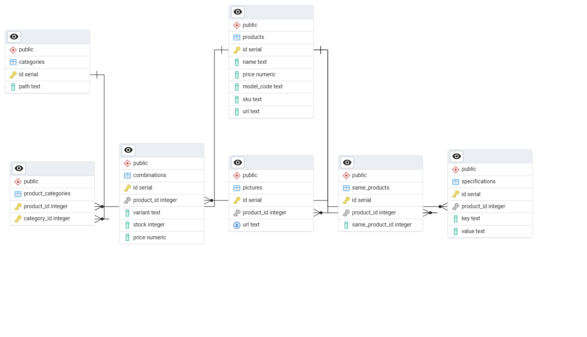
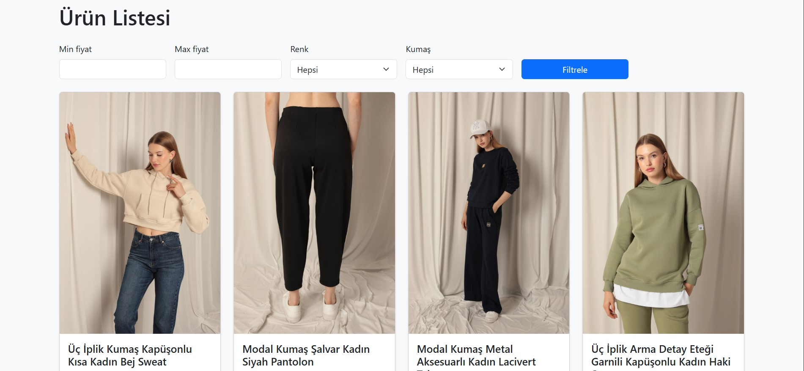
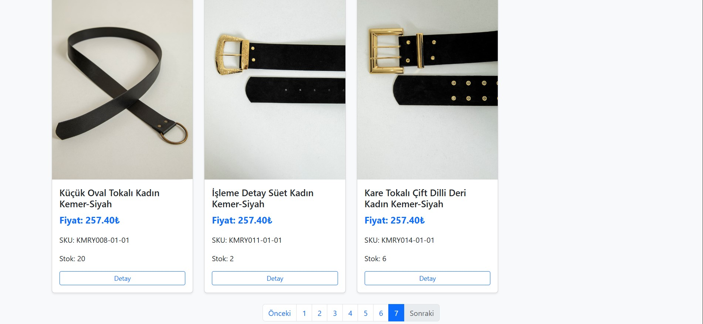
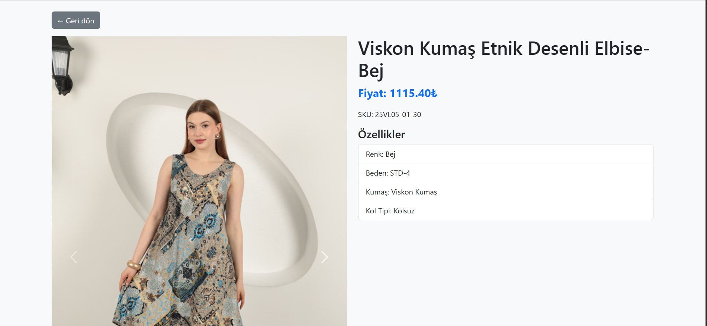

# KaktusModa Projesi

Bu proje Flask (Python) ve PostgreSQL ile geliştirilmiş bir e-ticaret uygulamasıdır. Tüm servisler Docker ile ayağa kaldırılır.

## Kurulum

1. **Depoyu klonla**
    ```bash
    git clone https://github.com/kbss1907/kaktusmoda_project.git
    cd kaktusmoda_project
    ```

2. **Docker ile başlat**
    ```bash
    docker-compose up -d --build
    ```

3. **Siteye eriş**
    ```
    http://localhost:5000
    ```

## Veritabanı Şeması

Aşağıdaki ana tabloları içerir:
- categories
- combinations
- pictures
- product_categories
- products
- same_products
- specifications

## Kullanım

Sitede ürünleri, kategorileri listeleyebilir ve ürün detaylarına bakabilirsiniz.

## Ekran Görüntüsü

## Veritabanı Şeması


## Ana Sayfa


## Ek Görüntüler



